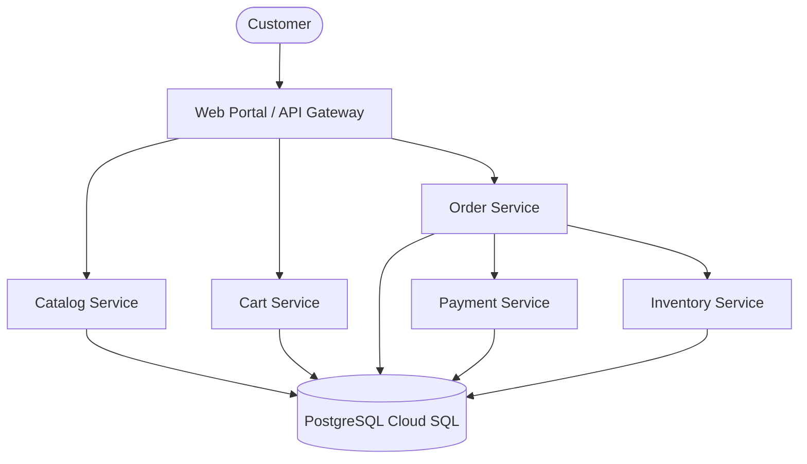

# Syntrix - Cloud Monitoring and Observability

A production-grade, cloud-native microservices e-commerce platform engineered specifically as an **Enterprise Observability and Monitoring Workload**. This project was developed as part of a Hackathon to demonstrate advanced cloud monitoring, distributed tracing, and organic fault injection across various compute environments.

## 🌟 Project Overview

While this application functions as a complete e-commerce store (browsing, cart, checkout, payment, and inventory management), its true architectural purpose is to naturally generate rich, structured telemetry data. It serves as a testing ground for cloud monitoring strategies, allowing DevOps and SRE teams to analyze distributed systems.

## 🏗️ Architecture & Microservices

The platform is designed around a **Microservices Architecture** with 5 independent backend services and an API Gateway.



### 🚀 Key Features

* **Distributed Tracing & Context Propagation**: Uses Python `ContextVars` to propagate `X-Request-Id` and `X-Trace-Id` headers across all service boundaries, enabling full end-to-end request lifecycle tracking.
* **Structured JSON Telemetry**: Replaces traditional plaintext logs with strict JSON schemas. Every service emits logs with timestamp, severity, service, environment, event, request/trace IDs, and latency, perfectly primed for Log Analytics and BigQuery ingestion.
* **Organic Fault Injection (Dev Panel)**: A built-in developer control panel allows on-the-fly toggling of business failures:
  * 🐢 **Database Slow Queries** (Simulates degraded performance)
  * ⏱️ **Payment Timeouts** (Simulates 3rd-party API failures)
  * 📦 **Inventory Shortages** (Simulates complex state rollback)
* **High-Volume Traffic Simulator**: Built-in load generator simulating up to 250 concurrent users interacting organically with the store to populate observability dashboards.

## ☁️ Cloud Infrastructure & Deployment

The application is heavily containerized and designed for deployment across a multi-compute environment strategy (GCP). The repository includes Infrastructure as Code (IaC) and bash deployment scripts that demonstrate the actual cloud implementation:

* **Google Kubernetes Engine (GKE)**: Orchestration for core business services (`deploy_gke.sh`, `setup_gke_cluster.sh`).
* **Google Cloud Run**: Serverless deployment for stateless components like the Gateway and Catalog services.
* **Google Compute Engine (GCE)**: Stateful legacy simulation for Inventory (`deploy_inventory.sh`, `inject_gce_logs.sh`).
* **Cloud SQL (PostgreSQL)**: Fully managed relational database backend (`setup_cloudsql.sh`, `update_cloudrun_sql.sh`).
* **Live Telemetry Pipeline**: Scripts and configurations for real-time log streaming and BigQuery views (`setup_live_pipeline.sh`, `realtime_log_streamer.py`, `bq_views.sql`).

## 🛠️ Local Setup & Orchestration

To run the entire suite locally for testing and development:

### Prerequisites
* Docker & Docker Compose

### Startup Instructions

```bash
# Build and orchestrate the API Gateway, 5 Microservices, and the PostgreSQL database
docker-compose up -d --build
```

The system will automatically initialize the database and run a data seed script to populate 50 mock products.

### Accessing the Application
* **Storefront UI**: `http://localhost:8000/`
* **API Gateway**: `http://localhost:8000/api/...`
* **Developer Control Panel**: Click "Dev Panel" in the footer of the web portal to access the fault injection tools and traffic simulator.

## 📊 Observability Output Example

```json
{
  "timestamp": "2026-08-25T13:45:12.123Z",
  "severity": "INFO",
  "service": "order-service",
  "environment": "production",
  "event": "order_created",
  "order_id": 10021,
  "total_amount": 149.99,
  "request_id": "req-xyz-123",
  "trace_id": "trace-abc-456",
  "latency_ms": 42
}
```

---
*Built for Cloud Monitoring, SRE, and DevOps Hackathon Demonstrations.*
