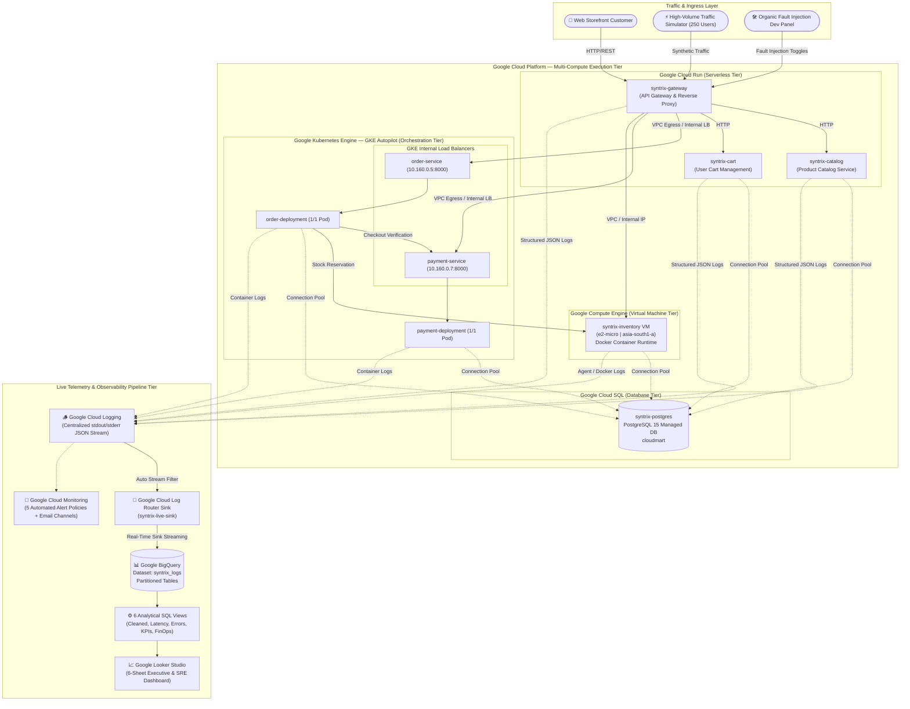
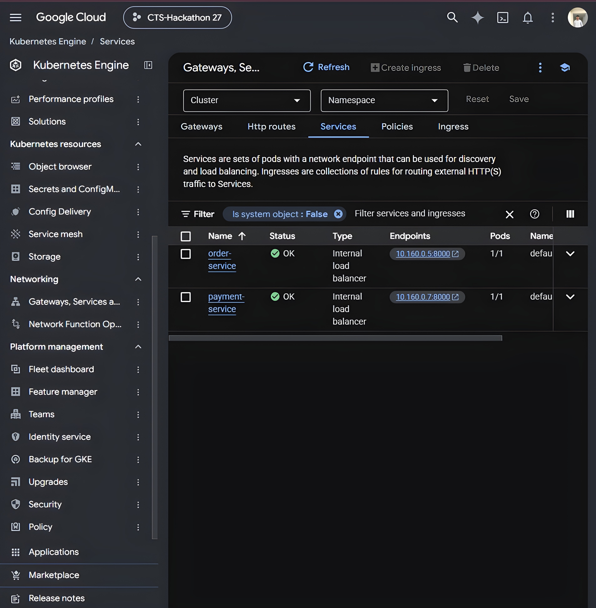
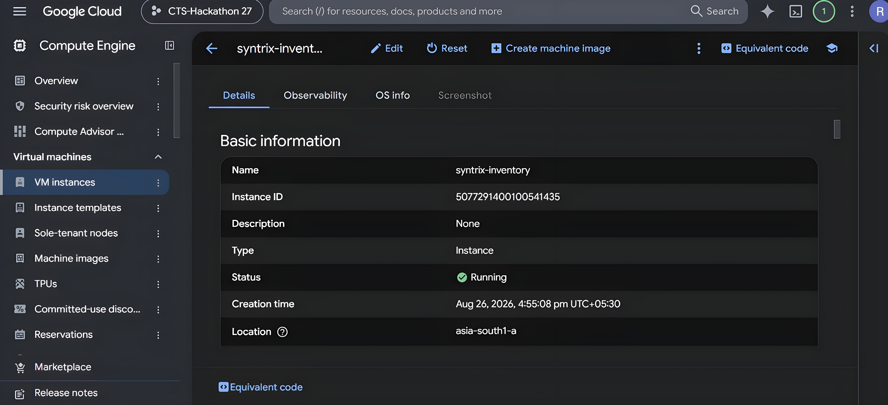
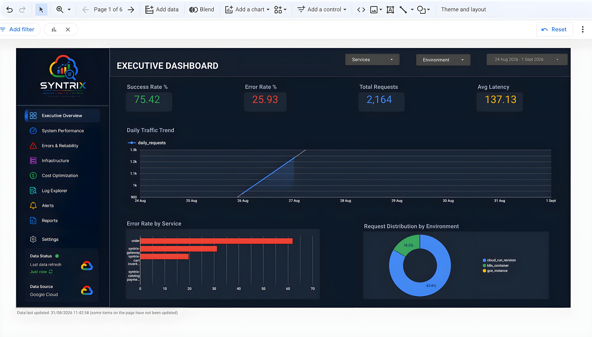
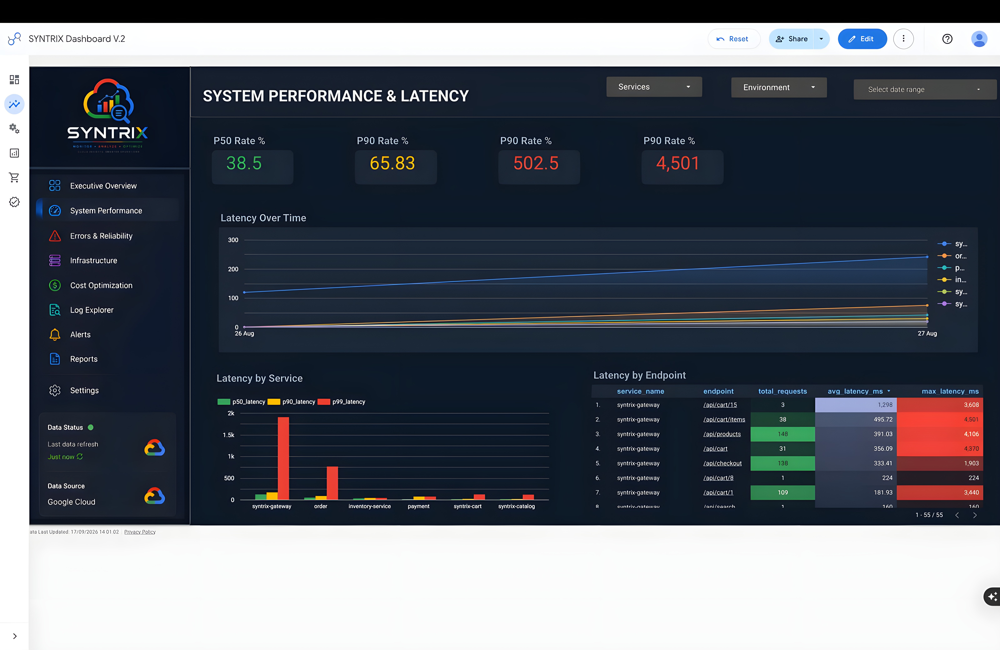
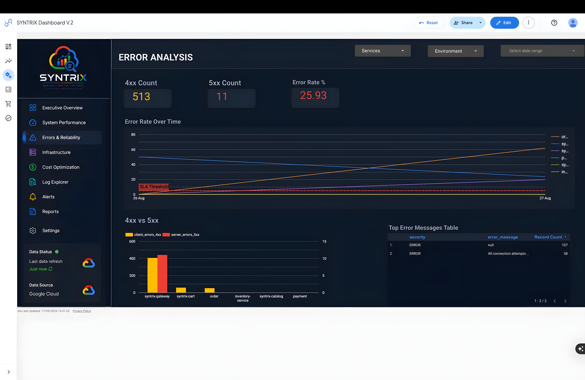
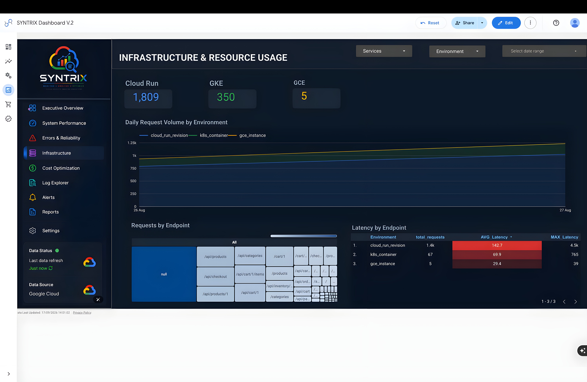
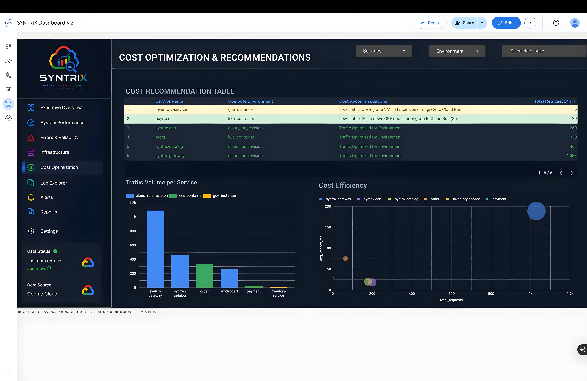
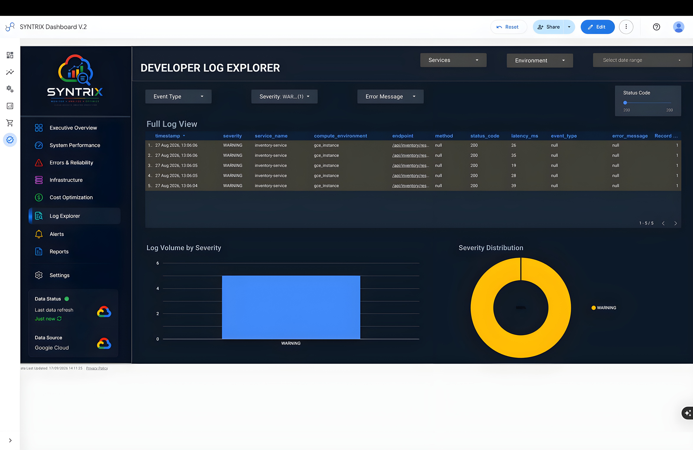

# SYNTRIX — Cloud Monitoring & Observability Platform

<p align="center">
  
  
  
  
  
  
  
  
  
  
</p>

---

## 📌 Executive Summary

**SYNTRIX (CloudMart)** is an enterprise-grade, cloud-native microservices e-commerce application engineered specifically as an **End-to-End Observability, SRE, and Cloud Monitoring Workload**. 

Developed for the **Cognizant (CTS) Cloud Hackathon (Project: CTS-Hackathon 27)**, the platform models realistic, distributed enterprise transaction flows while demonstrating advanced telemetry aggregation across a **hybrid multi-compute cloud architecture** on **Google Cloud Platform (GCP)**. It integrates serverless containers (**Cloud Run**), container orchestration (**Google Kubernetes Engine / GKE**), and legacy virtual machines (**Google Compute Engine / GCE**), flowing into **Cloud Logging**, a real-time **Log Router Sink**, **BigQuery** analytical data models, **Cloud Monitoring Alert Policies**, and a 6-layer **Looker Studio** observability dashboard.

---

## 🏗️ Multi-Compute System Architecture

The platform demonstrates a **multi-compute strategy** reflecting modern enterprise migrations where stateless workloads run serverless, high-throughput core business services run on Kubernetes, and legacy/stateful workloads run on virtual machines.



---

## ☁️ Google Cloud Platform (GCP) Services Implemented

SYNTRIX integrates **11 native Google Cloud Platform services** to form a resilient production environment:

| GCP Service | Implementation Role & Evidence in Repository | Compute / Data Tier |
|:---|:---|:---:|
| **Google Cloud Run** | Hosts `syntrix-gateway`, `syntrix-catalog`, and `syntrix-cart` as serverless container revisions; handles automatic TLS termination, scaling, and zero-scale idle efficiency (`deploy_phase1.sh`). | Serverless Compute |
| **Google Kubernetes Engine (GKE)** | Orchestrates mission-critical transactional services (`order-deployment`, `payment-deployment`) with internal service discovery and health probes on cluster `syntrix-gke` (`setup_gke_cluster.sh`, `deploy_gke.sh`). | Container Orchestration |
| **Google Compute Engine (GCE)** | Dedicated Compute Engine instance (`syntrix-inventory`) running on an `e2-micro` instance in `asia-south1-a`, simulating a stateful legacy microservice with automated VM startup scripts (`deploy_inventory.sh`). | Virtual Machine IaaS |
| **Google Cloud SQL** | Fully-managed PostgreSQL 15 database (`syntrix-postgres`) storing product catalogs, orders, shopping carts, and live inventory state (`setup_cloudsql.sh`). | Managed Database |
| **Google Cloud Logging** | Aggregates all JSON stdout/stderr logs from Cloud Run revisions, GKE pods, and GCE instances with strict trace and request ID context propagation (`shared/logging/logger.py`). | Observability Ingestion |
| **Google Cloud Log Router** | Real-time logging sink (`syntrix-live-sink`) routing filtered container/VM logs directly into BigQuery partitioned tables without polling scripts (`setup_live_pipeline.sh`). | Streaming ETL |
| **Google BigQuery** | Enterprise telemetry warehouse storing raw event streams (`syntrix_logs.raw_logs`) and powering 6 analytical materialized views for latency, error rate, and FinOps analytics (`bq_views.sql`). | Big Data Analytics |
| **Google Looker Studio** | Executive and operational observability dashboards providing 6 specialized stakeholder views with 1-minute live data freshness (`Looker_Dashboard_Design.md`). | BI & Visualization |
| **Google Cloud Monitoring** | 5 automated alert policies tracking 5xx error spikes, container CPU saturation, VM CPU thresholds, and BigQuery latency with multi-channel team notifications (`create_alerts.sh`). | SRE & Alerting |
| **Google Artifact Registry** | Container image registry (`syntrix-cloudmart` in `asia-south1-docker.pkg.dev`) storing versioned, multi-arch Docker images for all services. | CI/CD & Containers |
| **Google Secret Manager & IAM** | Secure secret distribution (`database-url`) and least-privilege IAM service account bindings (`cloudrun-app-sa`) for Cloud SQL and BigQuery access. | Security & Governance |

---

## 📸 Production Cloud Infrastructure Evidence

### 1. Google Kubernetes Engine (GKE) — Microservices & Internal Load Balancing

Core transaction microservices (`order-service` and `payment-service`) are deployed on GKE with internal load balancing annotations (`networking.gke.io/load-balancer-type: "Internal"`), ensuring private networking within the Google Cloud VPC.

<div align="center">
  
  <p><b>Figure 1:</b> <i>Google Cloud Console — Kubernetes Engine Services displaying <code>order-service</code> (10.160.0.5:8000) and <code>payment-service</code> (10.160.0.7:8000) running with healthy internal load balancers.</i></p>
</div>

### 2. Google Compute Engine (GCE) — Dedicated Inventory Instance

The stateful inventory service operates on a dedicated Compute Engine VM (`syntrix-inventory`) located in `asia-south1-a`, equipped with Docker runtime provisioning and Cloud SQL connectivity via instance metadata.

<div align="center">
  
  <p><b>Figure 2:</b> <i>Google Cloud Console — Compute Engine VM instances displaying <code>syntrix-inventory</code> (Instance ID: 5077291400100541435, Zone: asia-south1-a, Status: Running).</i></p>
</div>

---

## 🔄 Live Telemetry Pipeline & BigQuery Analytical Engine

Traditional observability architectures rely on batch polling scripts that introduce lag. SYNTRIX employs a zero-maintenance **Google Cloud Log Router Sink** that delivers telemetry directly to **BigQuery** in near real-time.

```
┌───────────────────────────────────────────────┐
│ Cloud Run / GKE / Compute Engine Applications │
└───────────────────────┬───────────────────────┘
                        │ Structured JSON to stdout
                        ▼
┌───────────────────────────────────────────────┐
│           Google Cloud Logging                │
└───────────────────────┬───────────────────────┘
                        │ Live Log Filter:
                        │ resource.type=("cloud_run_revision" OR "gce_instance" OR "k8s_container")
                        ▼
┌───────────────────────────────────────────────┐
│       Log Router Sink (syntrix-live-sink)     │
└───────────────────────┬───────────────────────┘
                        │ Streaming Insert (Partitioned)
                        ▼
┌───────────────────────────────────────────────┐
│           BigQuery: syntrix_logs              │
│    • run_googleapis_com_stderr (Cloud Run)    │
│    • stderr (GKE & GCE)                       │
│    • raw_logs (Historical)                    │
└───────────────────────┬───────────────────────┘
                        │ Real-Time SQL View Transformations
                        ▼
┌─────────────────────────────────────────────────────────────┐
│                 6 Materialized Views (ETL)                  │
│  1. looker_cleaned_logs       2. looker_latency_analysis    │
│  3. looker_error_analysis     4. looker_usage_monitoring    │
│  5. looker_performance_kpis   6. looker_cost_optimization   │
└───────────────────────┬─────────────────────────────────────┘
                        │ Direct BI Connector
                        ▼
┌───────────────────────────────────────────────┐
│     Looker Studio 6-Layer Observability       │
└───────────────────────────────────────────────┘
```

### Analytical BigQuery Views (`bq_views.sql`)

1. **`looker_cleaned_logs`**: Base cleaning view that parses raw JSON payloads, unifies compute resource labels across Cloud Run, GKE, and GCE, and normalizes timestamps and severity.
2. **`looker_latency_analysis`**: Calculates average, minimum, and maximum response times across microservice endpoints to pinpoint slow API bottlenecks.
3. **`looker_error_analysis`**: Aggregates 4xx (client) and 5xx (server) HTTP error frequencies per service to detect incident patterns.
4. **`looker_usage_monitoring`**: Tracks transaction volume, requests per minute, and hourly traffic distribution.
5. **`looker_performance_kpis`**: Computes SLA metrics including P50, P90, P99 latency percentiles and overall request success rates.
6. **`looker_cost_optimization`**: Custom SQL FinOps heuristics identifying idle service endpoints, over-provisioned compute hours, and rightsizing opportunities.

---

## 🚨 SRE Alerting & Incident Response Matrix

Automated alert policies are provisioned via `create_alerts.sh` using the Google Cloud Monitoring API. Each policy is bound to designated engineering responders:

| Alert Policy Name | Target GCP Resource | Metric Monitored | Threshold Condition | Notification Channel |
|:---|:---|:---|:---|:---|
| **Cloud Run 5xx Errors** | `cloud_run_revision` | `run.googleapis.com/request_count` (5xx) | `> 10 errors` in `60s` | Babu Senthil |
| **GKE High CPU Saturation** | `k8s_container` | `kubernetes.io/container/cpu/limit_utilization` | `> 80% CPU` for `180s` | Akash |
| **GCE High VM CPU Usage** | `gce_instance` | `compute.googleapis.com/instance/cpu/utilization` | `> 85% CPU` for `180s` | Roshni & Swathi |
| **BigQuery Long Execution** | `bigquery_project` | `bigquery.googleapis.com/query/execution_times` | `> 10,000ms` in `60s` | Ecclesiastes & Emayan |
| **Log Streamer Pipeline Failure**| `global` | `logging.googleapis.com/log_entry_count` (ERROR) | `> 5 errors` in `60s` | Varunshiyam |

---

## 📊 Looker Studio Observability Dashboards Showcase

The observability layer is powered by a **6-Sheet Looker Studio Dashboard Suite** directly connected to BigQuery with 1-minute live data freshness. Full specifications and chart formulas are documented in [`Looker_Dashboard_Design.md`](Looker_Dashboard_Design.md).

> 💡 **Image Upload Slot**:  
> Export your Looker Studio dashboard sheets and place the images in [`docs/images/looker/`](docs/images/looker/). Use the exact filenames below to have them render automatically on GitHub.

<details>
<summary>📂 <b>How to upload your Looker Studio screenshots</b> (Click to expand)</summary>

1. In Google Looker Studio, open your dashboard.
2. For each sheet, click **File → Download report** (or take a full-screen screenshot).
3. Save the image into the [`docs/images/looker/`](docs/images/looker/) directory with the corresponding filename:
   * Sheet 1: `docs/images/looker/sheet1_executive_overview.png`
   * Sheet 2: `docs/images/looker/sheet2_performance_latency.png`
   * Sheet 3: `docs/images/looker/sheet3_error_analysis.png`
   * Sheet 4: `docs/images/looker/sheet4_infrastructure_health.png`
   * Sheet 5: `docs/images/looker/sheet5_cost_optimization.png`
   * Sheet 6: `docs/images/looker/sheet6_log_explorer.png`
4. Commit and push to GitHub — each sheet will automatically display in its dedicated slot below!

</details>

---

### Sheet 1 — Executive Overview (KPIs, SLA & Platform Health)

* **Target Audience**: CTO, VP of Engineering, Leadership  
* **Key Visuals**: Total Request Volume, Uptime SLA %, Overall Failure Rate, Active Microservice Status, Severity Trendlines.  
* **Underlying BigQuery View**: `looker_cleaned_logs` & `looker_performance_kpis`

<div align="center">
  
  <p><i><b>Figure 3.1:</b> Sheet 1 — Executive Overview: Real-time high-level platform health scorecards, request volume, and overall system SLA.</i></p>
</div>

---

### Sheet 2 — System Performance & Latency (P50 / P90 / P99)

* **Target Audience**: Site Reliability Engineers (SRE), Performance Engineers, API Leads  
* **Key Visuals**: P50, P90, P99 Response Latency Trends, Service-by-Service Latency Heatmap, Slowest Endpoints Breakdown.  
* **Underlying BigQuery View**: `looker_latency_analysis`

<div align="center">
  
  <p><i><b>Figure 3.2:</b> Sheet 2 — System Performance & Latency: P50, P90, and P99 latency curves by endpoint to pinpoint slow API bottlenecks.</i></p>
</div>

---

### Sheet 3 — Error Analysis & Reliability (4xx vs 5xx Diagnostics)

* **Target Audience**: DevOps, Incident Responders, Software Engineers  
* **Key Visuals**: 4xx Client vs 5xx Server Error Ratios, Error Frequency Timeline, Top HTTP Error Codes (400, 404, 500, 504), Failure Log Samples.  
* **Underlying BigQuery View**: `looker_error_analysis`

<div align="center">
  
  <p><i><b>Figure 3.3:</b> Sheet 3 — Error Analysis & Reliability: Real-time breakdown of client vs server errors and spike detection.</i></p>
</div>

---

### Sheet 4 — Infrastructure & Resource Usage (Multi-Compute Health)

* **Target Audience**: Cloud Architects, Systems Engineers, SREs  
* **Key Visuals**: Multi-Compute Traffic Distribution (Cloud Run vs. GKE vs. GCE), Container Request Rates, VM Health, Ingress Load.  
* **Underlying BigQuery View**: `looker_usage_monitoring` & `looker_cleaned_logs`

<div align="center">
  
  <p><i><b>Figure 3.4:</b> Sheet 4 — Infrastructure & Resource Usage: Cross-platform telemetry monitoring Cloud Run, GKE, and Compute Engine tiers.</i></p>
</div>

---

### Sheet 5 — Cost Optimization & FinOps Recommendations

* **Target Audience**: FinOps Team, Engineering Directors, Product Owners  
* **Key Visuals**: Compute Rightsizing Recommendations, Idle Endpoint Detection, Estimated Monthly GCP Run-Rate, Cost per 10k Transactions.  
* **Underlying BigQuery View**: `looker_cost_optimization`

<div align="center">
  
  <p><i><b>Figure 3.5:</b> Sheet 5 — Cost Optimization & FinOps: Automated SQL-driven rightsizing suggestions and resource utilization efficiency.</i></p>
</div>

---

### Sheet 6 — Developer Deep Dive & Distributed Log Explorer

* **Target Audience**: Developers, QA Engineers, Support Analysts  
* **Key Visuals**: Searchable Raw Log Table, Filter controls by `service`, `severity`, `endpoint`, and `status_code`, Request ID & Trace ID correlation.  
* **Underlying BigQuery View**: `looker_cleaned_logs`

<div align="center">
  
  <p><i><b>Figure 3.6:</b> Sheet 6 — Developer Deep Dive: Granular log record inspection with end-to-end distributed trace tracking.</i></p>
</div>

---

## 🧪 Organic Fault Injection & Chaos Engineering

To test telemetry ingestion and SRE response, SYNTRIX incorporates an **Organic Fault Injection Engine** accessible via the built-in **Developer Control Panel** in the web storefront:

* 🐢 **Database Latency Injection**: Injects artificial database query pauses (up to 3000ms) to trigger latency anomalies and P99 degradation.
* ⏱️ **Payment Gateway Timeouts**: Simulates 3rd-party payment gateway dropouts and transient timeouts, generating HTTP 504 and 500 error cascades.
* 📦 **Inventory Stockout & Rollback**: Traces multi-service state rollbacks when stock reservation fails after order initiation.
* ⚡ **High-Volume Traffic Generator**: Built-in Python load testing engine (`simulate_traffic.sh`) capable of simulating up to 250 concurrent shoppers browsing, adding to cart, and checking out.

---

## 🔍 Distributed Tracing & Structured Logging Spec

Every microservice employs Python `ContextVars` to maintain context across asynchronous boundaries. Logs are emitted in standard JSON format:

```json
{
  "timestamp": "2026-08-26T11:25:34.891Z",
  "severity": "INFO",
  "service": "order-service",
  "environment": "cloud",
  "compute": "gke_container",
  "event": "order_created",
  "endpoint": "/api/orders",
  "method": "POST",
  "status_code": 201,
  "request_id": "req-9a8f2c3d",
  "trace_id": "trace-7e6d5c4b3a2f",
  "latency_ms": 48,
  "order_id": 10452,
  "amount": 289.50
}
```

* Headers `X-Request-Id` and `X-Trace-Id` are injected by the API Gateway and propagated through every downstream call, allowing full distributed transaction tracing in BigQuery and Cloud Logging.

---

## 🚀 Quickstart & Setup Guide

### Option 1: Local Development (Docker Compose)

Run the full stack (API Gateway, 5 Microservices, and PostgreSQL database) locally:

```bash
# 1. Clone repository
git clone https://github.com/Varunshiyam/Syntrix-Cloud-Monitoring-and-Observability.git
cd Syntrix-Cloud-Monitoring-and-Observability

# 2. Build and launch all services with Docker Compose
docker-compose up -d --build

# 3. Seed database with 50 catalog items
# (Runs automatically via Docker Compose seed container)
```

**Local Endpoints:**
* **Storefront Web UI**: `http://localhost:8000/`
* **API Gateway**: `http://localhost:8000/api/...`
* **Dev Fault Panel**: `http://localhost:8000/` (click "Dev Panel" in bottom footer)

---

### Option 2: Production Google Cloud Platform Deployment

Deploy the multi-compute architecture across GCP using the included deployment scripts:

```bash
# 1. Deploy Cloud SQL (PostgreSQL 15) & Secret Manager
chmod +x *.sh
./setup_cloudsql.sh

# 2. Deploy Cloud Run Services (Gateway, Cart, Catalog)
./deploy_phase1.sh

# 3. Provision GKE Cluster & Deploy Order + Payment Services
./setup_gke_cluster.sh
./deploy_gke.sh

# 4. Deploy Inventory Service to Google Compute Engine (GCE)
./deploy_inventory.sh

# 5. Initialize Real-Time BigQuery Log Router Sink & Views
./setup_live_pipeline.sh

# 6. Configure Cloud Monitoring Alert Policies
./create_alerts.sh
```

---

## 👥 Hackathon Team & Responsibilities

* **Varunshiyam** — Project Lead, BigQuery Analytics Pipeline, Looker Studio Architecture
* **Babu Senthil & Mugunthan** — Cloud Run Microservices & Serverless Gateway
* **Akash** — Google Kubernetes Engine (GKE) Cluster & Microservices Deployment
* **Roshni & Swathi** — Google Compute Engine (GCE) Virtual Machine Configuration
* **Ecclesiastes & Emayan** — BigQuery Data Modeling & Log Stream Engineering

---

<p align="center">
  <b>SYNTRIX — Enterprise Cloud Observability Platform</b><br>
  <i>Built for CTS Hackathon 2026</i>
</p>
